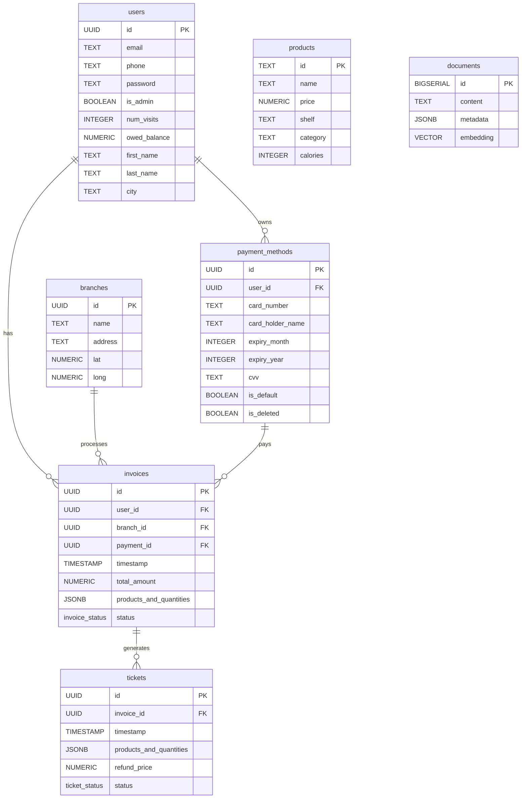

# 📊 قاعدة بيانات دكان فيجين - Supabase Schema

## 🗄️ **نظرة عامة على قاعدة البيانات**

**النوع:** Supabase (PostgreSQL-based)  
**المشروع:** Tuwaiq's Project  
**البيئة:** Production  
**المنظمة:** alaaabdulaziz97@gmail.com's Org  

---

## 📋 **الجداول الموجودة**

### 1. **جدول المستخدمين (users)**
```sql
CREATE TABLE users (
    id UUID PRIMARY KEY,
    email TEXT,
    phone TEXT,
    password TEXT,
    is_admin BOOLEAN,
    num_visits INTEGER,
    owed_balance NUMERIC,
    first_name TEXT,
    last_name TEXT,
    city TEXT
);
```

**الوصف:** يحتوي على معلومات المستخدمين الأساسية، بيانات الدخول، والمعلومات الشخصية.

---

### 2. **جدول التذاكر (tickets)**
```sql
CREATE TABLE tickets (
    id UUID PRIMARY KEY,
    invoice_id UUID REFERENCES invoices(id),
    timestamp TIMESTAMP,
    products_and_quantities JSONB,
    refund_price NUMERIC,
    status ticket_status
);
```

**الوصف:** لإدارة تذاكر الاسترداد والشكاوى المرتبطة بالفواتير.

---

### 3. **جدول المخزون (inventory)**
```sql
-- تفاصيل الأعمدة غير مرئية في الصورة
-- يحتوي على معلومات المخزون والكميات المتوفرة
```

**الوصف:** لتتبع المخزون والكميات المتوفرة من المنتجات.

---

### 4. **جدول الفروع (branches)**
```sql
CREATE TABLE branches (
    id UUID PRIMARY KEY,
    name TEXT,
    address TEXT,
    lat NUMERIC,
    long NUMERIC
);
```

**الوصف:** معلومات الفروع والعناوين والإحداثيات الجغرافية.

---

### 5. **جدول الفواتير (invoices)**
```sql
CREATE TABLE invoices (
    id UUID PRIMARY KEY,
    user_id UUID REFERENCES users(id),
    branch_id UUID REFERENCES branches(id),
    payment_id UUID REFERENCES payment_methods(id),
    timestamp TIMESTAMP,
    total_amount NUMERIC,
    products_and_quantities JSONB,
    status invoice_status
);
```

**الوصف:** الفواتير الرئيسية مع تفاصيل المشتريات والمدفوعات.

---

### 6. **جدول المنتجات (products)**
```sql
CREATE TABLE products (
    id TEXT PRIMARY KEY,
    name TEXT,
    price NUMERIC,
    shelf TEXT,
    category TEXT,
    calories INTEGER
);
```

**الوصف:** كتالوج المنتجات مع الأسعار والتصنيفات والمعلومات الغذائية.

---

### 7. **جدول المستندات (documents)**
```sql
CREATE TABLE documents (
    id BIGSERIAL PRIMARY KEY,
    content TEXT,
    metadata JSONB,
    embedding VECTOR
);
```

**الوصف:** للبحث المتقدم والذكاء الاصطناعي (RAG system).

---

### 8. **جدول طرق الدفع (payment_methods)**
```sql
CREATE TABLE payment_methods (
    id UUID PRIMARY KEY,
    user_id UUID REFERENCES users(id),
    card_number TEXT,
    card_holder_name TEXT,
    expiry_month INTEGER,
    expiry_year INTEGER,
    cvv TEXT,
    is_default BOOLEAN,
    is_deleted BOOLEAN
);
```

**الوصف:** طرق الدفع المحفوظة للمستخدمين.

---

## 🔗 **العلاقات بين الجداول**



---

## 🎯 **الأنواع المخصصة (Custom Types)**

### **invoice_status**
```sql
-- نوع مخصص لحالات الفواتير
-- القيم المحتملة: pending, paid, cancelled, refunded
```

### **ticket_status**
```sql
-- نوع مخصص لحالات التذاكر
-- القيم المحتملة: open, in_progress, resolved, closed
```

---

## 🔧 **الميزات المتقدمة**

### **1. البحث المتجهي (Vector Search)**
- جدول `documents` يدعم البحث المتقدم
- استخدام `VECTOR` type للـ embeddings
- دعم RAG (Retrieval-Augmented Generation)

### **2. البيانات المرنة (JSONB)**
- `products_and_quantities` في الفواتير والتذاكر
- `metadata` في المستندات
- تخزين بيانات معقدة ومرنة

### **3. الجغرافيا**
- إحداثيات GPS للفروع (`lat`, `long`)
- دعم للخرائط والمواقع

### **4. الأمان**
- **RLS:** معطل حالياً (RLS disabled)
- **Role:** postgres
- **Realtime:** معطل حالياً

---

## 📊 **إحصائيات قاعدة البيانات**

| الجدول | عدد الأعمدة | المفاتيح الأساسية | المفاتيح الخارجية |
|--------|-------------|-------------------|-------------------|
| users | 10 | 1 | 0 |
| tickets | 6 | 1 | 1 |
| inventory | - | - | - |
| branches | 5 | 1 | 0 |
| invoices | 8 | 1 | 3 |
| products | 6 | 1 | 0 |
| documents | 4 | 1 | 0 |
| payment_methods | 9 | 1 | 1 |

---

## 🚀 **التوصيات للتحسين**

### **1. الفهارس (Indexes)**
```sql
-- فهارس للبحث السريع
CREATE INDEX idx_users_email ON users(email);
CREATE INDEX idx_invoices_user_id ON invoices(user_id);
CREATE INDEX idx_invoices_timestamp ON invoices(timestamp);
CREATE INDEX idx_products_category ON products(category);
CREATE INDEX idx_branches_location ON branches(lat, long);
```

### **2. الأمان**
```sql
-- تفعيل Row Level Security
ALTER TABLE users ENABLE ROW LEVEL SECURITY;
ALTER TABLE invoices ENABLE ROW LEVEL SECURITY;
ALTER TABLE payment_methods ENABLE ROW LEVEL SECURITY;
```

### **3. النسخ الاحتياطي**
- تفعيل النسخ الاحتياطي التلقائي من Supabase Dashboard
- إعداد نقطة استرداد أسبوعية

### **4. المراقبة**
```sql
-- مراقبة الأداء
SELECT * FROM pg_stat_activity;
SELECT * FROM pg_stat_database;
SELECT * FROM pg_stat_user_tables;
```

---

## 📝 **ملاحظات مهمة**

1. **المفاتيح الأساسية:** جميع الجداول تستخدم UUID ما عدا `products` (TEXT) و `documents` (BIGSERIAL)
2. **العلاقات:** نظام علاقات قوي بين الجداول
3. **البيانات المرنة:** استخدام JSONB للبيانات المعقدة
4. **الأمان:** RLS معطل - يجب تفعيله للإنتاج
5. **الأداء:** يحتاج فهارس للبحث السريع

---

*تم تحديث هذا التوثيق في: 2025-01-15*
